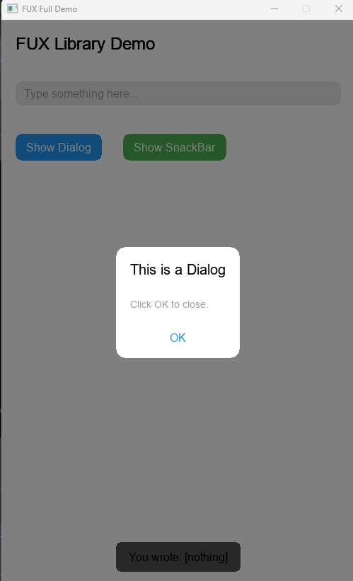
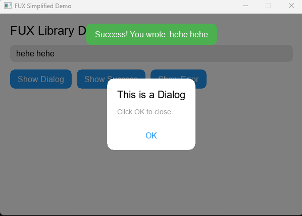

# libfux
<< Summery >>LibFux its my personal _flutter like_ gui maker for my cpp projects.
Its simplify the process of creating ui without anything unrelated to the ui you can make easily UI's free fast as possible!

Currently in dev,..( I will update it as soon as i have free time, contact me or pull request is available. )

##  What's New in the Latest Version?

The new version of the code is **much simpler and cleaner**. Here's a quick look at the key improvements:

-  **No ContextProvider Needed**  
  Direct access to app state with `AppContext::instance()`. No nested contexts.

-  **Simplified Dialogs**  
  Just use `showDialog(...)` — no manual state or `If(...)` checks.

-  **Easy Reactivity with Obx**  
  Use `Obx([] { ... })` for auto-updating widgets based on state.

-  **One-Line SnackBars**  
  Show snackbars instantly without setup:
Example: The main.cpp is your example only put it on your visual studio, config the SDL lib and enjoy power of simplify.

Creator: Morteza Mansory
Current Version: 0.4.4 { In Dev version }
